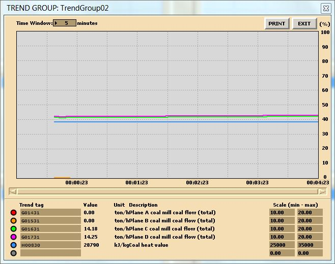
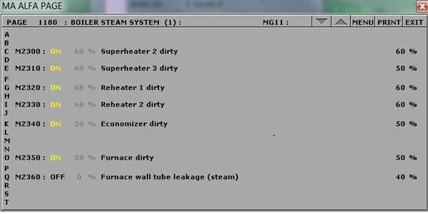
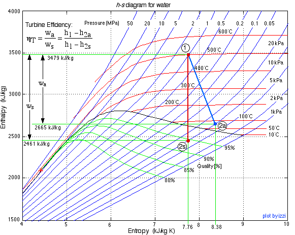
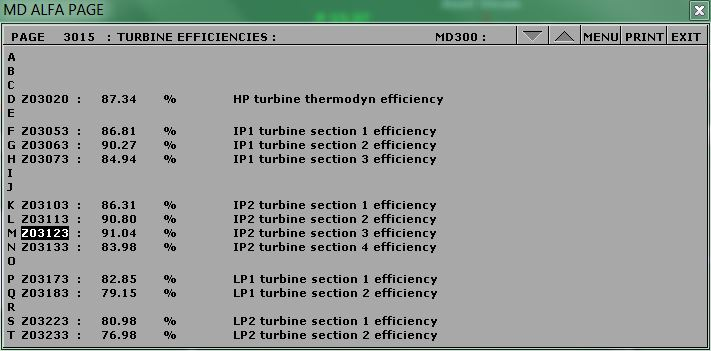
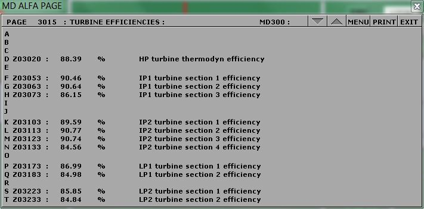
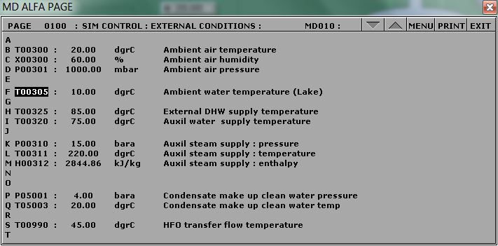
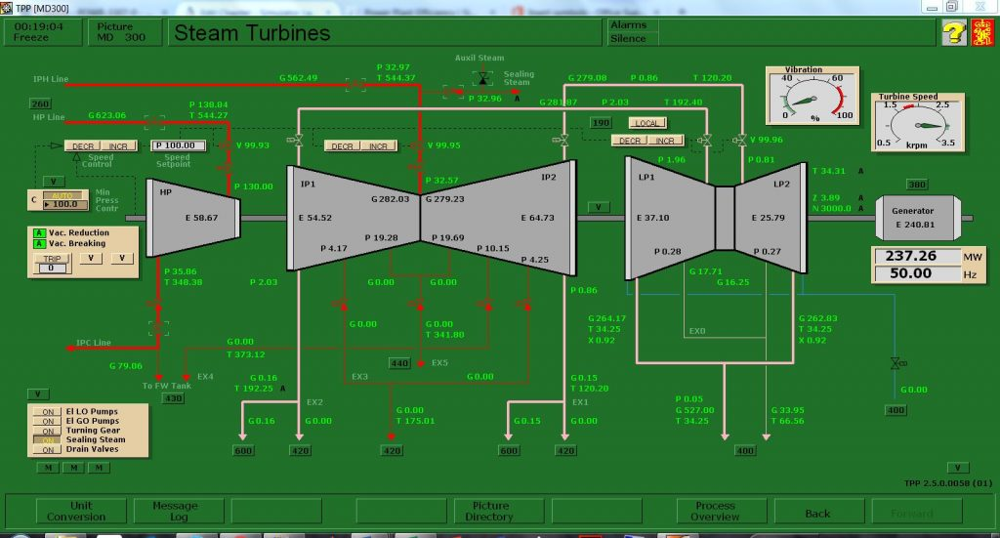

## Overview

- Simulator lab exercises (SIM LABS) support Thermodynamics and Thermal Power Plant Simulator (TPPS) courses
- Built on Kongsberg's TPPS platform
- This session presents a selection of SIM LABS developed for classroom and lab use

## The Challenge

- Power Engineering students often struggle with theoretical concepts
- Instructors face limited instructional time to cover both theory and practice
- A gap remains between classroom theory and hands on plant operation

## How SIM LABS Help

- Strengthen understanding of core ThermoFluids principles
- Support application of theory in realistic operational contexts
- Allow students to visualize processes and explore system behaviour
- Build cause and effect connections between operating parameters and outcomes

## Learning Benefits

- Enhance conceptual comprehension
- Prepare learners for hands on work with real equipment in a physical plant
- Reinforce safe operational practices
- Build environmental awareness within steam plant systems

## SIM LABS

- Boiler Efficiency
- Turbine Efficiency
- Power Plant Efficiency
- NOx Emissions
- Heat Exchangers
- Combustion Analysis

## SIM LABS Featured in This Session

- Boiler Efficiency
- Turbine Efficiency
- Power Plant Efficiency

# Boiler Efficiency

## Objective and Theory

- Operate the plant in four modes and compute boiler thermal efficiency: 230 MW burning HFO, 80% load burning biofuel, 80% load burning coal, and 80% load burning coal with soot buildup
- Boiler thermal efficiency is the ratio of energy to steam over energy from fuel $$
  \eta_{\text{boiler}} = \frac{m_s (h_2 - h_1)}{m_f HV} \times 100\%
  $$

## Data Collection

## Heating Values: Trend Tags to Log

| Tag    | Description                    |
|--------|--------------------------------|
| H00810 | HFO heating value              |
| H00870 | Pellet heating value (biofuel) |
| H00830 | Coal heating value             |

## Simulating Soot Buildup

## Normal Operation

| Tag    | Description                                   | Value      | Unit  |
|--------|-----------------------------------------------|------------|-------|
| P02601 | HP line steam pressure                        | 144.72     | bara  |
| T02602 | HP line steam temperature                     | 537.81     | °C    |
| H02603 | HP line steam enthalpy                        | 3422       | kJ/kg |
|        |                                               |            |       |
| T02447 | Start up heat exchanger feedw outlet temp     | 248.92     | °C    |
| H02448 | Start up heat exchanger feedw outlet enthalpy | 1071.3     | kJ/kg |
|        |                                               |            |       |
| G02600 | HP line steam flow                            | 650.25     | tonnes/h |
|        | Heat Transferred:                             | 1528542675 | kJ/h  |

## Soot Buildup

| Tag    | Description                                   | Value      | Unit  |
|--------|-----------------------------------------------|------------|-------|
| P02601 | HP line steam pressure                        | 141.72     | bara  |
| T02602 | HP line steam temperature                     | 463.93     | °C    |
| H02603 | HP line steam enthalpy                        | 3217.6     | kJ/kg |
|        |                                               |            |       |
| T02447 | Start up heat exchanger feedw outlet temp     | 243.08     | °C    |
| H02448 | Start up heat exchanger feedw outlet enthalpy | 1046.3     | kJ/kg |
|        |                                               |            |       |
| G02600 | HP line steam flow                            | 666.3      | tonnes/h |
|        | Heat Transferred:                             | 1446737190 | kJ/h  |

## Boiler Efficiency: Lab and Deliverables

- Four initial conditions: I10, I15, I14 (coal), and I14 with soot configured via MD250
- Log HFO, pellet, and coal heating value tags, then use steam tables to find enthalpy values
- Deliverables: trend plots for all four conditions, efficiency computations, and a conclusion comparing results

# Turbine Efficiency

## Objective and Theory

- Operate the plant at 35% load, 80% load, and 230 MW to compute the isentropic enthalpy change and thermal efficiency for the HP turbine
- Turbine efficiency compares the actual enthalpy drop to the ideal, constant entropy expansion

$$\eta_{\text{Turbine}} = \frac{H_1 - H_{2'}}{H_1 - H_2}$$

- A higher pressure drop in a single stage increases the reheat factor and lowers efficiency, which is why multi-stage turbines with reheat perform better

## h-s Diagram

## Turbine Efficiency: 101 MW Sample

## Turbine Efficiency: 250 MW Sample

## HP Turbine Efficiency (Abbreviated)

| Tags | Description | Units | I13 35% Load | I14 80% Load | I10 230 MW |
|------------|----------------|------------|------------|------------|------------|
| H03008 | HP Turbine steam enthalpy at control valve | kJ/kg | 3239.99 | 3421 | 3403.27 |
| H03016 | HP Turbine steam enthalpy at outlet | kJ/kg | 2927.25 | 3083.99 | 3075.49 |
| Z03020 | HP turbine thermodynamic efficiency | \% | 85.95 | 88.4 | 88.39 |
|  | Actual Change in Enthalpy | kJ/kg | 312.74 | 337.01 | 327.78 |
|  | Isentropic Change in Enthalpy | kJ/kg | 363.86 | 381.23 | 370.83 |
|  | Calculated ηTurbine | \% | 85.95 | 88.4 | 88.39 |

## Turbine Efficiency: Lab and Deliverables

- Three initial conditions: I13 (35% load), I14 (80% load), and I10 (230 MW)
- Compare results across conditions to determine which load yields the most favourable efficiency
- Deliverables: trend plots for all three conditions, efficiency computations, and a conclusion with suggestions for further study

# Power Plant Efficiency

## Objective and Theory

- Operate the plant at full capacity and compute overall efficiency under three conditions: normal operation, high cooling water temperature (35°C), and without regeneration
- The Rankine cycle efficiency is net work output over heat supplied in the boiler

$$\eta_{\text{Rankine}} = \frac{W_{\text{Turbine}} - W_{\text{Pump}}}{Q_{\text{boiler}}}$$

## Reheat and regeneration

- Reheat and regeneration both raise the average temperature at which heat is supplied, improving efficiency over the simple Rankine cycle

$$\eta_{\text{thermal}} = \frac{W_{\text{Turbines}} - W_{\text{Pumps}}}{Q_{\text{boiler}} + Q_{\text{Reheat1}} + Q_{\text{Reheat2}}}$$

## Hints & Tips: Trend Tags to Log

| Tag      | Description                 |
|----------|-----------------------------|
| `Q02395` | Reheater 1 transferred heat |
| `Q02375` | Reheater 2 transferred heat |

## Hints & Tips: Temperature Settings

- For **Boiler Feedwater Inlet Temperature**, use the Startup Heat Exchanger Feedwater Outlet Temperature (tag `T02447`).
- For the third calculation, make sure you closed all steam extraction valves and set T00305 to 10°C:

## Lake Water Temperature Setting

## No steam extraction

## Power Plant Efficiency: Lab and Deliverables

- Run initial condition I10 and draw a T-S diagram of the cycle including reheat and regeneration
- Set cooling water temperature (tag T00305) to 35°C for the high temperature case, and to 10°C with extraction valves closed for the no regeneration case
- Deliverables: T-S diagram, trend plots, efficiency computations for all three conditions, and a conclusion

# Summary

## Conclusion

- SIM LABS bridge the gap between theory and practical plant operation
- Each lab pairs a theoretical model with hands on simulator operation, reinforcing safe practice and environmental awareness
- Q&A
