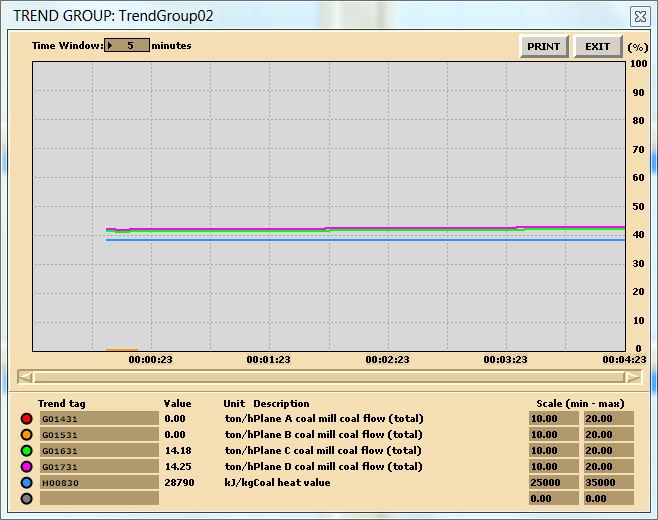
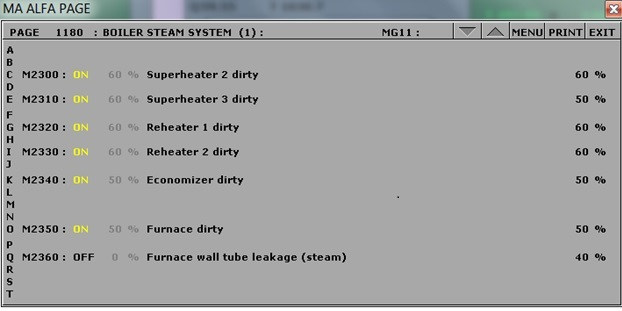

# Boiler Efficiency {#sec-boiler_efficiency}

::: callout-note
## Learning Objectives

Operate the plant in the following modes and compute the boiler thermal efficiency:

- 230 MW, burning HFO
- 80% load, burning biofuel
- 80% load, burning coal
- 80% load, burning coal with soot buildup
:::

## Theory

First, we define efficiency. There are many ways to present it; for example, efficiency is the ability to perform a task without wasting energy, effort, or time. Mathematically, it is the ratio of useful output to thermal energy input.

Laypersons often use the terms *efficiency* and *effectiveness* interchangeably; however, efficiency relates to minimizing waste, whereas effectiveness relates to maximizing output (more on this in @sec-heat_exchangers).

Boiler efficiency is sometimes defined as combustion efficiency, which is determined by the burner's ability to completely burn fuel, accounting for unburnt fuel and excess air in the exhaust. Thermal efficiency, on the other hand, indicates the heat exchanger's (i.e., the boiler's) ability to transfer heat from the combustion process to the water or steam.

In general, the maximum attainable boiler efficiency depends on factors such as the fuel-burning method, furnace design, and heat transfer surfaces. In addition, fuel type, boiler load, and operating practices influence efficiency. In this lab, we focus on fuel type, boiler load, and best practices.

## Boiler Thermal Efficiency

Next, we express the boiler thermal efficiency\index{Boiler Thermal Efficiency} as follows:

$$\eta_{\text{boiler}} = \frac{\text{Energy to steam}}{\text{Energy from fuel}}$$

Here, the energy to steam is the heat transfer required to generate steam. Let:

- $h_2$ = specific enthalpy of steam \[kJ/kg\]
- $h_1$ = specific enthalpy of feedwater \[kJ/kg\]

Because steam is generated at constant pressure, the heat required to produce 1 kg of steam is:

$$\text{Energy to steam} = (h_2 - h_1) \quad \text{[kJ]}$$

Energy from fuel is calculated from the mass of fuel used and its calorific value. For coal, this is the heating value measured in a bomb calorimeter, corresponding to the internal energy of combustion. Let:

- $m_f$ = mass of fuel burned over a given time
- $m_s$ = mass of steam generated over the same time
- $HV$ = heating value of the fuel \[kJ/kg\]

$$\text{Energy from fuel} = m_f \times HV \quad \text{[kJ]}$$

Thus, the boiler thermal efficiency is:

$$\eta_{\text{boiler}} = \frac{m_s (h_2 - h_1)}{m_f HV} \times 100\%$$

::: callout-tip
## Lab Instructions

You will run four different initial conditions in this lab:

- **I10:** 230 MW, burning HFO
- **I15:** 80% load, burning biofuel
- **I14:** 80% load, burning coal
- **I14:** 80% load, burning coal with soot (use MD250 to configure soot variables)

For each condition, collect the relevant data to compute the boiler thermal efficiency.
:::

## Hints & Tips

For data collection, use trends as shown in the lab manual (see *Trends sample*).

In addition to pressure, temperature, and flow measurements, log the following tags in your trends:

| Tag    | Description                    |
|--------|--------------------------------|
| H00810 | HFO heating value              |
| H00870 | Pellet heating value (biofuel) |
| H00830 | Coal heating value             |

To calculate enthalpy values, you may use an app or an online tool such as the [Superheated Steam Table](https://goo.gl/GdVM4U).

For the coal operation with soot buildup, use MD250 and set malfunctions as shown in the lab manual (see *MD250 malfunction settings*).

::: callout-important
## Deliverables

Your lab report must include:

- **Trend plots:** All plots for each of the four conditions
- **Computation:** Calculate boiler thermal efficiency for the specified conditions
- **Conclusion:** A summary (max. 500 words; use a text box if using Excel) comparing results and suggesting areas for further study
:::

## Further Reading

- *Fundamentals of Classical Thermodynamics* (SI Version): Evaluation of Actual Combustion Processes. [@wylen1986]
- *Thermal Engineering*: Capacity and Efficiency of Steam Generating Units. [@solberg]
- *Basic Engineering Thermodynamics in SI Units*: Boiler calculations. [@joel1996]