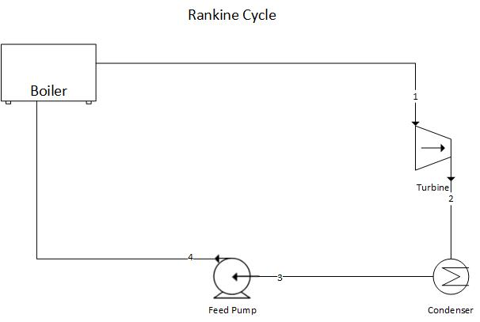
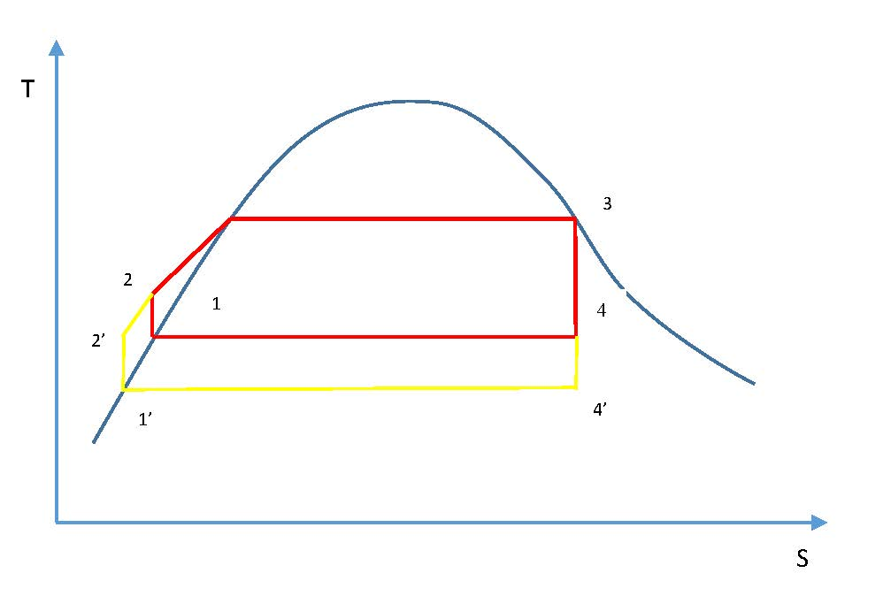
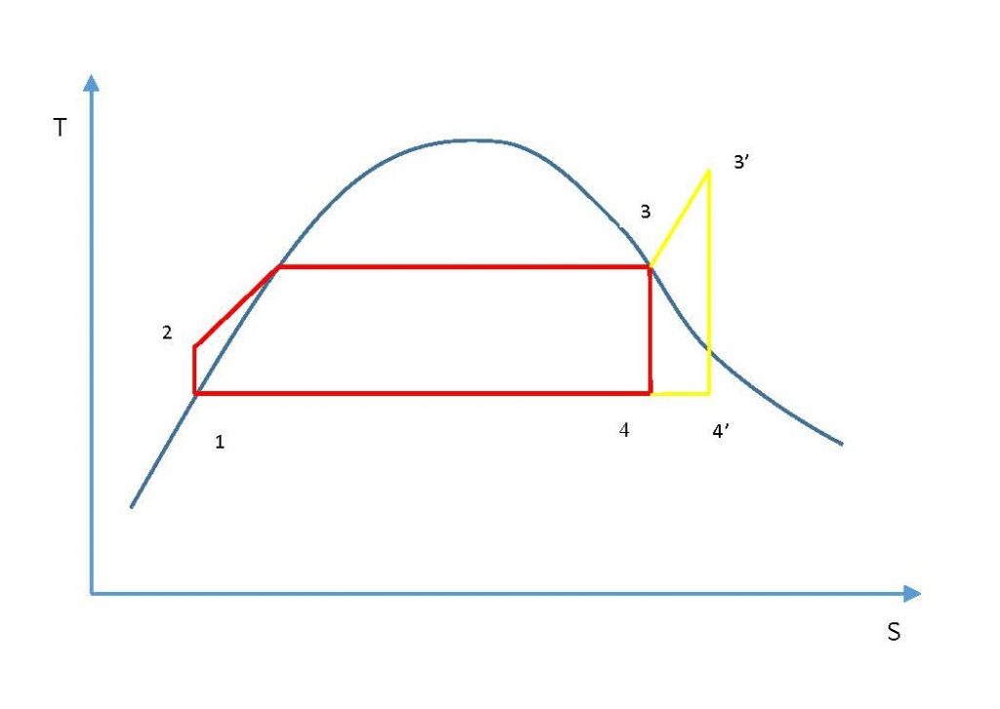
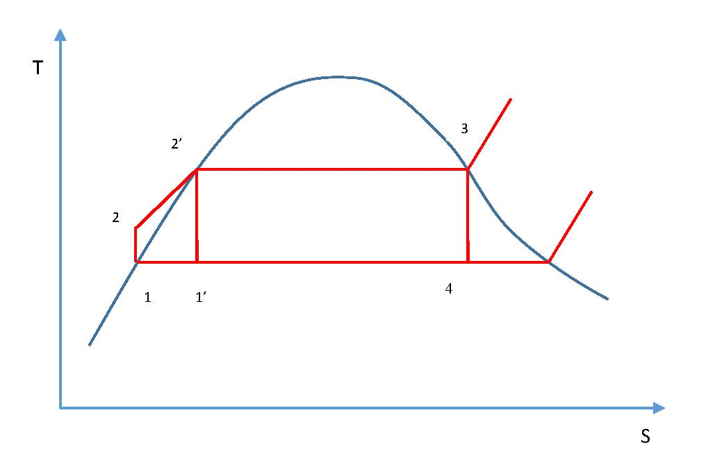
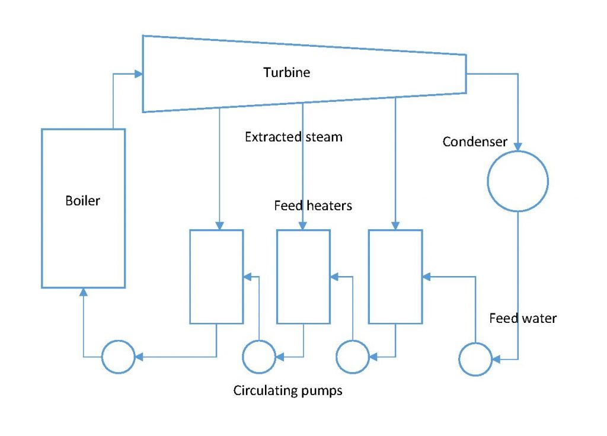
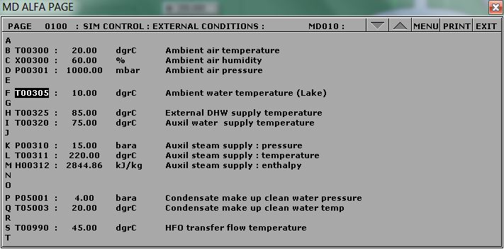
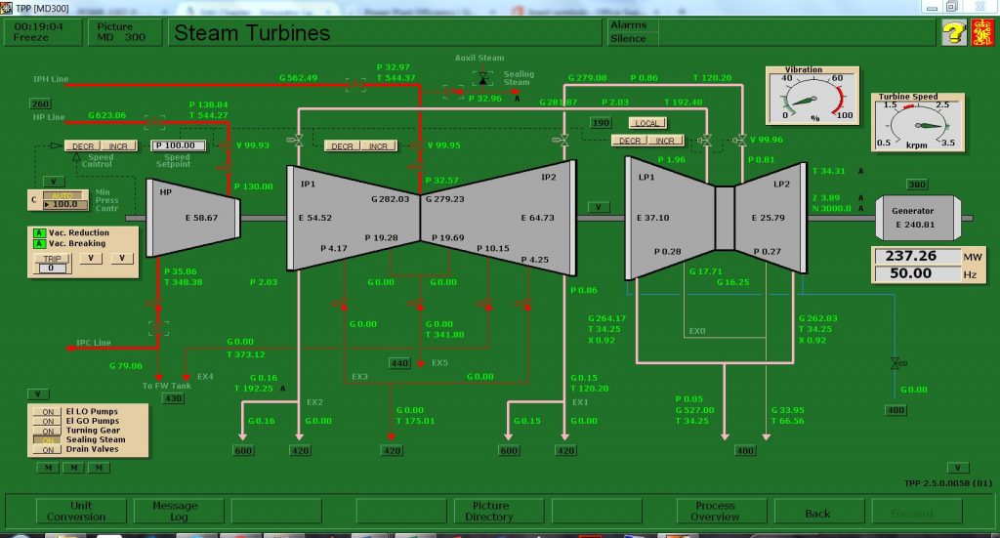

# Power Plant Efficiency {#sec-power_plant_efficiency}

::: callout-note
## Learning Objectives

Operate the Plant at full generating capacity and compute the Power Plant Efficiency when the plant is operating:

- Under normal conditions,
- With the cooling water temperature very high (lake water temperature: 35°C),
- Without regeneration.
:::

## Theory

Excluding hydroelectric power plants, most power generating plants employ a type of boiler and steam turbine. High-pressure steam leaves the boiler and enters the turbine. The steam expands in the turbine and does work which enables the turbine to drive the electric generator. The exhaust steam leaves the turbine and enters the condenser where heat is transferred from the steam to cooling water. The pressure of the condensate leaving the condenser is increased in the pump, thereby enabling the condensate to flow into the boiler. This thermodynamic cycle is known as the **Rankine Cycle**.

## The Rankine Cycle Efficiency

Some heat is always lost from the steam to cooling water. In addition, feed pumps consume energy, thus reducing the net work output. The Rankine Cycle efficiency\index{Rankine Cycle} is expressed as:

$$\eta_{\text{Rankine}} = \frac{\text{Net work output}}{\text{Heat supplied in the boiler}}$$

or equivalently:

$$\eta_{\text{Rankine}} = \frac{W_{\text{Turbine}} - W_{\text{Pump}}}{Q_{\text{boiler}}}$$

Referring to the schematic diagram and using the enthalpy values at each state point in the Rankine cycle:

$$\eta_{\text{Rankine}} = \frac{(h_1 - h_2) - (h_4 - h_3)}{h_1 - h_4}$$

## Improvements to the Rankine Cycle Efficiency

### Effect of Pressure and Temperature

If the exhaust pressure drops from $P_4$ to $P_4'$, with the corresponding decrease in the temperature at which heat is rejected in the condenser, the net work increases. Similarly, if the steam is superheated in the boiler, the work output is further increased. Superheating is achieved by increasing the time the steam is exposed to the flue gases. As a result, for a given power output, a plant using superheated steam will be smaller in size than one using dry saturated steam.

### The Reheat Cycle

The efficiency of the Rankine cycle is increased by superheating the steam. To improve efficiency further without requiring exotic high-temperature materials, the **reheat cycle** has been developed. In this cycle, steam expands to some intermediate pressure in the high-pressure turbine and is then reheated in the boiler, after which it expands in the low-pressure turbine to the exhaust pressure.

The thermal efficiency of the Rankine cycle with reheat is:

$$\eta_{\text{thermal}} = \frac{W_{12} + W_{67} - W_{43}}{Q_{41} + Q_{26}}$$

### The Regenerative Cycle

Another variation of the Rankine cycle is the **regenerative cycle**, which uses feedwater heaters. In a simple Rankine cycle, feedwater heating from state 2 to 2' occurs at a much lower average temperature than the vaporisation process from 2' to 3. Consequently, the average temperature at which heat is supplied is lower than in the corresponding Carnot cycle, and the Rankine cycle efficiency is therefore less than that of the Carnot cycle.

In the regenerative cycle, feedwater enters the boiler at a point between states 2 and 2', raising the average temperature at which heat is supplied and thus improving efficiency.

## Plant Thermal Efficiency

To calculate the overall plant thermal efficiency, the heat added in the reheater sections of the boiler must be included:

$$\eta_{\text{thermal}} = \frac{W_{\text{Turbines}} - W_{\text{Pumps}}}{Q_{\text{boiler}} + Q_{\text{Reheat1}} + Q_{\text{Reheat2}}}$$

::: callout-tip
## Lab Instructions

Run the initial condition **I10 230 MW_oil_auto** and complete the following:

1.  Draw a T–S diagram of the Rankine cycle (not to scale) including reheat and regeneration.
2.  Using the Trend Group Directory, collect the relevant process values.
3.  Calculate the overall thermal efficiency of the plant under three conditions:
    - **Normal conditions**,
    - **High cooling water temperature** — set Variable List Page 0100, tag `T00305` to 35°C,
    - **No regeneration** — close all steam extraction valves and set `T00305` to 10°C.
:::

## Hints & Tips

The following tags must be logged in your trends:

| Tag      | Description                 |
|----------|-----------------------------|
| `Q02395` | Reheater 1 transferred heat |
| `Q02375` | Reheater 2 transferred heat |

- For **Boiler Feedwater Inlet Temperature**, use the Startup Heat Exchanger Feedwater Outlet Temperature (tag `T02447`).
- For the third calculation, make sure you closed all steam extraction valves and set T00305 to 10°C:
- To calculate enthalpy values, use a steam tables app or an [online](https://goo.gl/GdVM4U)superheated steam table.

::: callout-important
## Deliverables

Your lab report must include the following:

1.  **T–S Diagram** — As per the lab instructions above.
2.  **Trend Plots** — Supply all plots taken during the lab.
3.  **Computation** — Calculate the overall thermal efficiency of the plant under each of the three conditions.
4.  **Conclusion** — A summary (maximum 500 words) comparing your results and suggesting areas for further study.
:::

## Further Reading

- *Applied Thermodynamics for Engineering Technologists* — Steam Plant. [@eastop1993]
- *Fundamentals of Classical Thermodynamics (SI Version)* — Vapour Power Cycles. [@wylen1986]
- *Thermodynamics and Heat Power* — Vapour Power Cycles. [@granet2015]