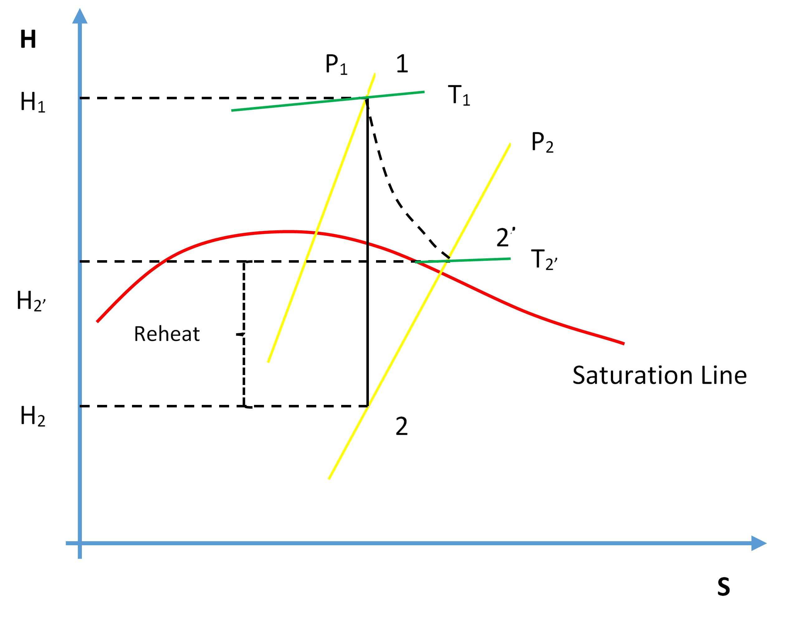

# Turbine Efficiency {#sec-turbine_efficiency}

::: callout-note
## Learning Objectives

Operate the Plant at the following generating capacities to compute the isentropic change in enthalpy and thermal efficiency for the HP turbine:

- 35% Load (I13),
- 80% Load (I14),
- 230 MW (I10).
:::

## Theory

Recall from the First and Second Law of Thermodynamics\index{Second Law of Thermodynamics} that the adiabatic process where entropy remains constant provides the maximum energy for work. As shown on the H-S coordinates, the difference in enthalpy, $(H_1 - H_2)$, is maximum when the lowest enthalpy $(H_2)$ is reached at the exit conditions. The ideal expansion is, therefore, a vertical line.

{fig-align="center"}

On the diagram above, $T_1$, $P_1$, and $P_2$ are known process variables; for example, $H_1$ is determined by using $T_1$ and $P_1$. $H_2$ can then be found by drawing a vertical line from $P_1$ to $P_2$ by following adiabatic isentropic expansion (expansion at constant entropy).

Non-ideal processes, or real processes, however, do not present straight lines as shown on the Mollier diagram due to such factors as friction. If the expansion is not isentropic (i.e., entropy is not constant but increases), the lowest enthalpy $H_2$ cannot be reached at the exit conditions; in other words, $H_{2'} > H_2$. This means that $\Delta H$ for the ideal expansion is greater than $\Delta H$ for the non-ideal expansion between the same pressure boundaries. The internal turbine efficiency is therefore given by:

$$\eta_{\text{Turbine}} = \frac{\text{Actual change in enthalpy}}{\text{Isentropic change in enthalpy}}$$

$$\eta_{\text{Turbine}} = \frac{(H_1 - H_{2'})}{(H_1 - H_2)}$$

The difference in enthalpy $H_{2'} - H_2$ is called the reheat factor and is the basis for multi-stage turbines. As can be seen on the Mollier diagram, the pressure curves are divergent. This means that the higher the pressure drop in a single-stage turbine, the greater the reheat factor and in turn the lower the turbine efficiency. However, if the steam is expanded through multiple stages and between each stage the steam is reheated, higher turbine efficiencies can be achieved. We will see this effect later in the Power Plant Efficiency lab.

::: callout-tip
## Lab Instructions

You will run 3 different initial conditions in this lab:

- 35% Load (I13),
- 80% Load (I14),
- 230 MW (I10).

For each condition, collect the relevant data to compute the isentropic change in enthalpy for the HP turbine. Compare your results — which of the three conditions yields the most favourable results and why?
:::

## Hints & Tips

In addition to various pressure and temperature values, log the following tags in your trends:

- Z03020
- E03018

To calculate the enthalpy values, you may use an app or online tool such as the [Superheated Steam Table](https://goo.gl/GdVM4U).

::: callout-important
## Deliverables

Your lab report is to include the following:

- **Trend plots:** Supply all plots taken for each of the 3 conditions,
- **Computation:** Calculate the turbine efficiency for the 3 conditions specified,
- **Conclusion:** Write a summary (max. 500 words; use a text box if using Excel) comparing your results and suggestions for further study.
:::

## Further Reading

- *Thermodynamics and Heat Power*: Vapor power cycles. [@granet2015]